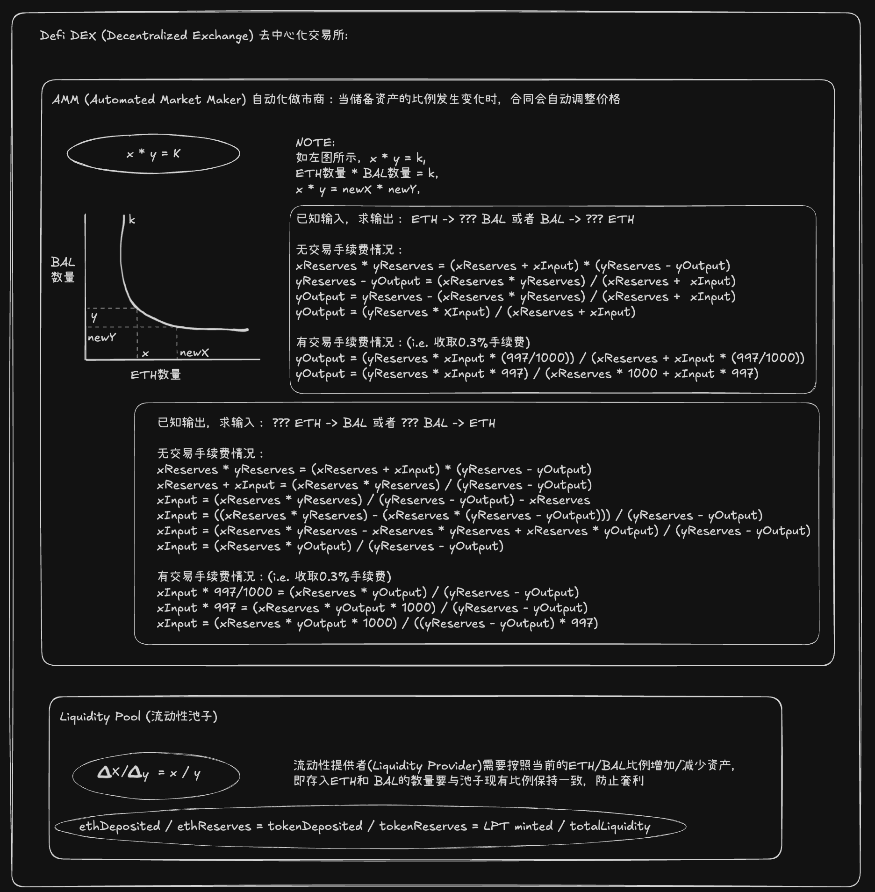

# DeFi DEX - Decentralized Exchange

A DeFi DEX application implementing an Automated Market Maker (AMM) protocol with constant product formula, liquidity provision, and token swapping capabilities, inspired by [speedrunethereum](https://speedrunethereum.com/challenge/dex).

## Concept and Explanation

This project implements a decentralized exchange using the constant product market maker formula (x × y = k), similar to Uniswap V2. Users can:
- Swap ETH for BAL tokens and vice versa
- Provide liquidity to earn trading fees
- Monitor real-time pool reserves and liquidity positions
- Visualize the bonding curve for price discovery

The DEX uses a 0.3% trading fee (997/1000) to incentivize liquidity providers and ensure sustainable protocol operations.



## Features

### Core DEX Operations

- **Token Swapping**
  - ETH ↔ BAL token swaps with real-time price calculation
  - Automatic slippage handling through AMM formula
  - 0.3% trading fee on all swaps
  - Debounced input for optimized UX (300ms delay)
  - Visual price curve showing current market state

- **Liquidity Management**
  - Add liquidity to the ETH/BAL pool
  - Withdraw liquidity with proportional asset returns
  - Liquidity Provider Token (LPT) tracking
  - Automatic ratio maintenance (constant product)
  - Real-time reserve balance display

### Advanced Features

- **Smart Price Calculation**
  - Forward calculation: Input amount → Output amount
  - Reverse calculation: Desired output → Required input
  - Fee-adjusted pricing with `calculateXInput` function
  - Protection against rounding errors (+1 wei safety margin)

- **Real-time Dashboard**
  - Live ETH and BAL reserve monitoring
  - Total liquidity pool value tracking
  - User's LPT balance display
  - Interactive bonding curve visualization
  - Wallet connection with address display

- **Optimized User Experience**
  - Debounced async calculations (reduces network calls)
  - Loading states during calculations
  - Responsive design (mobile & desktop)
  - Dark/Light theme support
  - Toast notifications for transactions
  - Copy-to-clipboard address functionality

### Smart Contract Architecture

The protocol consists of 2 main contracts:

1. **Balloon.sol** - ERC20 token (BAL) with 1000 initial supply
2. **DEX.sol** - Core AMM implementation with:
   - `init()` - Initialize liquidity pool
   - `price()` - Calculate output for given input (with fees)
   - `calculateXInput()` - Reverse calculation for exact output
   - `ethToToken()` - Swap ETH for BAL tokens
   - `tokenToEth()` - Swap BAL tokens for ETH
   - `deposit()` - Add liquidity and mint LPTs
   - `withdraw()` - Remove liquidity and burn LPTs

## Tech Stack

### Frontend
- **Next.js 16** - React framework with App Router
- **TypeScript** - Type-safe development
- **Wagmi v2** - React hooks for Ethereum
- **RainbowKit** - Wallet connection UI
- **Viem** - Ethereum library
- **TanStack Query** - Data fetching and caching
- **Tailwind CSS 4** - Styling
- **Shadcn/ui** - UI components
- **Sonner** - Toast notifications
- **Lucide React** - Icon library

### Smart Contracts
- **Solidity ^0.8.20** - Smart contract language
- **Hardhat** - Development environment
- **OpenZeppelin** - Secure contract libraries (ERC20, IERC20)
- **Viem** - Contract interactions and deployment

## Project Structure

```
defi-dex/
├── packages/
│   ├── hardhat/              # Smart contracts
│   │   ├── contracts/        # Solidity contracts
│   │   │   ├── Balloon.sol   # ERC20 token
│   │   │   └── DEX.sol       # AMM implementation
│   │   ├── scripts/          # Deployment scripts
│   │   │   └── deploy.ts     # Deploy & initialize
│   │   ├── test/             # Contract tests
│   │   ├── hardhat.config.ts
│   │   └── package.json
│   │
│   └── web/                  # Next.js frontend
│       ├── src/
│       │   ├── app/          # App router pages
│       │   │   ├── layout.tsx
│       │   │   ├── page.tsx
│       │   │   └── globals.css
│       │   ├── components/   # React components
│       │   │   ├── info/           # DEX & user info cards
│       │   │   │   ├── dex-info-card.tsx
│       │   │   │   └── user-info-card.tsx
│       │   │   ├── global/         # Shared components
│       │   │   │   ├── header.tsx
│       │   │   │   ├── curve.tsx   # Bonding curve viz
│       │   │   │   ├── crypto-address.tsx
│       │   │   │   ├── providers.tsx
│       │   │   │   ├── theme-provider.tsx
│       │   │   │   └── mode-toggle.tsx
│       │   │   └── ui/             # Shadcn components
│       │   │       ├── button.tsx
│       │   │       ├── card.tsx
│       │   │       ├── input.tsx
│       │   │       └── ...
│       │   ├── abis/         # Contract ABIs
│       │   │   ├── balloon.ts
│       │   │   └── dex.ts
│       │   └── lib/
│       │       └── utils.ts
│       ├── public/
│       ├── next.config.ts
│       └── package.json
│
├── package.json
├── pnpm-workspace.yaml
└── README.md
```

## Getting Started

### Prerequisites

- **Node.js** v18 or later
- **pnpm** v8 or later
- **Wallet** (MetaMask or compatible)

Install pnpm if you haven't:
```bash
npm install -g pnpm
```

### Installation

1. Clone the repository
```bash
git clone <repository-url>
cd defi-dex
```

2. Install all dependencies:
```bash
pnpm install
```

3. Set up environment variables:

Create `.env.local` file in `packages/web/`:
```env
NEXT_PUBLIC_WALLETCONNECT_PROJECT_ID=your_walletconnect_project_id
NEXT_PUBLIC_CONTRACT_BALLOON_ADDRESS=0x...
NEXT_PUBLIC_CONTRACT_DEX_ADDRESS=0x...
```

### Development

#### Start Local Blockchain

```bash
cd packages/hardhat
pnpm node
```

This will start a local Hardhat network on `http://localhost:8545`

#### Deploy Contracts

In a new terminal:
```bash
cd packages/hardhat
pnpm deploy:localhost
```

This will:
- Deploy the Balloon (BAL) token contract
- Deploy the DEX contract
- Initialize the DEX with 5 ETH and 5 BAL
- Transfer 10 BAL to deployer for testing
- Generate ABI files in `packages/web/src/abis/`

Copy the deployed contract addresses to your `.env.local` file.

#### Start Frontend

In another terminal:
```bash
cd packages/web
pnpm dev
```

Visit `http://localhost:3000`

### Commands

#### Root Commands
```bash
# Install all dependencies
pnpm install

# Build all packages
pnpm build

# Run command in specific package
pnpm --filter <package-name> <command>

# Run command in all packages
pnpm -r <command>
```

#### Hardhat Commands
```bash
cd packages/hardhat

# Compile contracts
pnpm build

# Run tests
pnpm test

# Start local node
pnpm node

# Deploy to localhost
pnpm deploy:localhost

# Clean artifacts
pnpm clean
```

#### Web Commands
```bash
cd packages/web

# Start dev server
pnpm dev

# Build for production
pnpm build

# Start production server
pnpm start

# Lint code
pnpm lint

# Format code
pnpm format
```

## Usage Guide

### Connecting Wallet

1. Click "Connect Wallet" in the header
2. Select your preferred wallet (MetaMask, WalletConnect, etc.)
3. Approve the connection
4. Switch to localhost network (Chain ID: 31337)

### Swapping Tokens

#### ETH to BAL
1. Ensure "Sell ETH" is selected (default)
2. Enter ETH amount in the "Sell" input
3. Buy amount will auto-calculate (with 0.3% fee)
4. Click "Swap" to execute
5. Confirm the transaction in your wallet

#### BAL to ETH
1. Click the swap direction button (↓)
2. Now "Sell BAL" should be selected
3. Enter BAL amount in the "Sell" input
4. Buy amount will auto-calculate
5. Click "Swap" to execute (approval + swap)

### Providing Liquidity

1. Enter ETH amount in "Deposit liquidity" field
2. Required BAL amount is calculated automatically
3. Click the send button (→)
4. Approve BAL token spending (first time only)
5. Confirm deposit transaction
6. Receive Liquidity Provider Tokens (LPTs)

### Withdrawing Liquidity

1. Check your LPT balance in "User Info"
2. Enter LPT amount to withdraw
3. Click the send button (→)
4. Confirm transaction
5. Receive proportional ETH and BAL

### Monitoring Pool

- **ETH Reserve** 💰💰💰 - Total ETH in the pool
- **BAL Reserve** 🎈🎈🎈 - Total BAL tokens in the pool
- **Total Liquidity** 💦💦💦 - Total LPTs minted
- **Bonding Curve** - Visual representation of price relationship

## Key Concepts

### Constant Product Formula

The DEX uses the formula: **x × y = k**

Where:
- `x` = ETH reserve
- `y` = BAL reserve
- `k` = constant product

When you trade, the product remains constant, ensuring:
- Larger trades have worse prices (slippage)
- Pool can never be fully drained
- Price discovery through supply/demand

### Price Calculation

**Forward (input → output):**
```
yOutput = (yReserves × xInput × 997) / (xReserves × 1000 + xInput × 997)
```

**Reverse (desired output → required input):**
```
xInput = (yOutput × xReserves × 1000) / ((yReserves - yOutput) × 997)
```

### Trading Fees

- 0.3% fee on all swaps (997/1000 ratio)
- Fees accrue to liquidity providers
- Incentivizes liquidity provision

### Liquidity Provider Tokens (LPTs)

- Represent your share of the pool
- Proportional to your contribution
- Redeemable for underlying assets
- Earn trading fees automatically

## Performance Optimizations

### Debounced Calculations
- 300ms delay after typing stops
- Prevents excessive network calls
- Improves user experience
- Reduces gas estimation calls

### Memoized Functions
- `useCallback` for stable function references
- Prevents unnecessary re-renders
- Optimizes React performance

### Efficient State Management
- Minimal state updates
- Batched calculations
- Loading states for async operations

## Security Considerations

### Smart Contract Safety
- ✅ Uses OpenZeppelin's audited ERC20
- ✅ Reentrancy protection through checks-effects-interactions
- ✅ Integer overflow protection (Solidity 0.8.20+)
- ✅ Minimum liquidity requirements
- ✅ Slippage protection through +1 wei buffer

### Frontend Security
- ✅ Input validation
- ✅ Error handling for all transactions
- ✅ Safe arithmetic operations
- ✅ Proper approval flows

## Troubleshooting

### Transaction Fails
- **Insufficient Balance**: Ensure you have enough ETH/BAL
- **Insufficient Allowance**: Approve the DEX contract first
- **Slippage Too High**: Try a smaller amount
- **Gas Estimation Failed**: Check pool liquidity

### Connection Issues
- **Wrong Network**: Switch to localhost (Chain ID 31337)
- **RPC Error**: Restart Hardhat node
- **Wallet Not Detected**: Install MetaMask or compatible wallet

### Pool Initialization
- **Already Initialized**: Pool can only be initialized once
- **Ratio Mismatch**: Use equal values of ETH and BAL for init

## Future Enhancements

- [ ] Multi-token support (multiple trading pairs)
- [ ] Time-weighted average price (TWAP) oracle
- [ ] Fee tier options (0.05%, 0.3%, 1%)
- [ ] Concentrated liquidity (Uniswap V3 style)
- [ ] Limit orders
- [ ] Historical price charts
- [ ] LP farming rewards
- [ ] Governance token

## License

MIT

## Contributing

Contributions are welcome! Please feel free to submit a Pull Request.

## Resources

- [Uniswap V2 Whitepaper](https://uniswap.org/whitepaper.pdf)
- [Constant Product AMM Explained](https://docs.uniswap.org/contracts/v2/concepts/protocol-overview/how-uniswap-works)
- [Wagmi Documentation](https://wagmi.sh/)
- [Hardhat Documentation](https://hardhat.org/)

